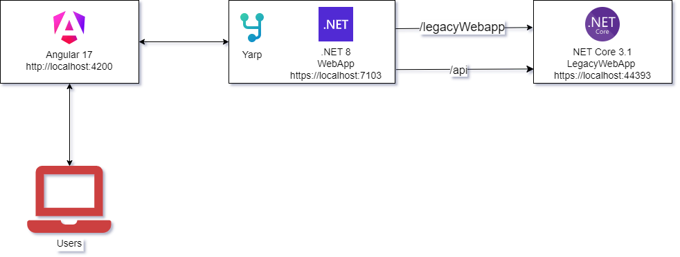
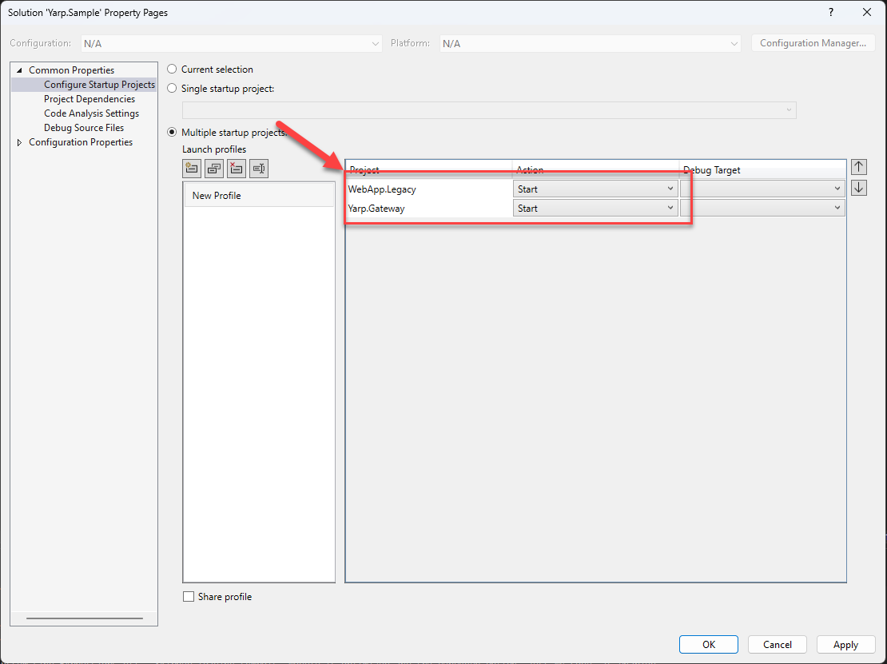

# Welcome to Yarp Sample Solution for side-by-side by increment migration
## Architectural Diagram

## Instructions for Incremental Migration with YARP
1. Add YARP [routes](https://github.com/ozairashfaqueSSW/YarpSampleSolution/blob/Side-by-side-incremental-migration-using-yarp/src/Yarp.Gateway/Config/YarpLocalDevConfigExtensions.cs#L36) and [clusters](https://github.com/ozairashfaqueSSW/YarpSampleSolution/blob/Side-by-side-incremental-migration-using-yarp/src/Yarp.Gateway/Config/YarpLocalDevConfigExtensions.cs#L61) for Legacy WebApp using Code-based configuration approach. Refer to the [YarpLocalDevConfigExtensions](https://github.com/ozairashfaqueSSW/YarpSampleSolution/blob/Side-by-side-incremental-migration-using-yarp/src/Yarp.Gateway/Config/YarpLocalDevConfigExtensions.cs) class for details:
```csharp
// Route for Legacy WebApp
new()
{
    RouteId = "webAppLegacyApiServePath",
    ClusterId = webAppLegacyApiClusterId,
    Match = new RouteMatch
    {
        Path = "/api/{**catch-all}",
    },
},

// Cluster for legacy WebApp api endpoint
new()
{
    ClusterId = webAppLegacyApiClusterId,
    Destinations = new Dictionary<string, DestinationConfig>
                {
                    {"webAppLegacyApiServePath", new DestinationConfig{ Address = webAppLegacyAddress } }
                }
},
// See the YarpLocalDevConfigExtensions class in the repo for further details
```
2. Load configuration settings using in-memory configuration class: [YarpInMemoryConfiguration](https://github.com/ozairashfaqueSSW/YarpSampleSolution/blob/Side-by-side-incremental-migration-using-yarp/src/Yarp.Gateway/Config/YarpInMemoryConfiguration.cs#L6C14-L6C40) 
```csharp
// YarpInMemoryConfiguration is the boilerplate class, see the repo for more details.
services
    .AddReverseProxy()
    .Services.AddSingleton<IProxyConfigProvider>(
    new YarpInMemoryConfiguration(webRoutes, webClusters));
```
3. Add AddControllers() service and MapControllers() middleware before the ReverseProxy middleware
```csharp
builder.Services.AddControllers();


app.MapControllers();
app.MapReverseProxy();
// Checkout program.cs file for further details
```
4. Migrate the controller WeatherForecastControllerr from Legacy 3.1 core to .NET 8 WebApp
## Prerequisites
&nbsp;
### 1. Clone the repo at [YarpSampleSolution](https://github.com/ozairashfaqueSSW/YarpSampleSolution). or use the following git command
 ```bash
  git clone https://github.com/ozairashfaqueSSW/YARPSampleSolution.git
  ```
### 2. Node.js (https://nodejs.org)
**RECOMMENDED VERSION:** [20.10.0](https://nodejs.org/en/download) - While previous versions may not work 
&nbsp;
### 2. Node Package Manager (NPM)
**RECOMMENDED VERSION:** 10 ^ - The recommended version of NPM is 10 and above. This comes bundled with the previous Node.js installation.
- Ensure you are running the recommended version of NPM by opening a console and entering:
  > npm -v
- If do not have a version of NPM 10 or above, you can install the latest version by opening a console and running the command:

  > npm install -g npm@latest
&nbsp;
### 3. Angular CLI (https://cli.angular.io/)
- The Angular CLI is a command line tool used to help build and run the Angular Front End application.
- You can check if Angular CLI is already installed by running the command
  > npm -v
- If Angular CLI isn't currently installed, you can run the following command to install the latest version of Angular CLI that works with Node.js (the last Node.js version tested is v20.10.0):
  > npm install -g @angular/cli@latest
&nbsp;
### 4. Required SDK's
Please ensure all of the below SDK's are installed.
To check what SDK's are currently installed you can run `dotnet --list-sdks`.
Example:

```bash
   C:\Users\tomek>dotnet --list-sdks

   3.1.101 [C:\Program Files\dotnet\sdk]
   8.0.100 [C:\Program Files\dotnet\sdk]
```
#### .NET Core 3.1 SDK

- **Recommended Version:** 3.1 or higher
- **Download:** [Download .NET Core](https://dotnet.microsoft.com/en-us/download/dotnet)
- **Usage:** Used to build and run .NET Core Back End API  [WebApp.Legacy](https://github.com/ozairashfaqueSSW/YARP.Sample.Solution/tree/master/src/WebApp.Legacy).

#### .NET 8.0 SDK

- **Recommended Version:** 8.0.100
- **Download:** [Download .NET 8.0 SDK](https://dotnet.microsoft.com/en-us/download/dotnet)
- **Usage:** Used to build and run .NET 8 Project [Yarp.Gateway](https://github.com/ozairashfaqueSSW/YARP.Sample.Solution/tree/master/src/Yarp.Gateway).

## The F5 Experience:
### Angular Serve:
1. Open the directory **AngularUI** in terminal or command prompt.
2. Execute npm run serve or ng serve
   
3. Ignore the above address.
   
### .Net:
1. Open the solution properties
2. Check the "Multiple startup projects" option
3. Set WebApp.Legacy (.NET core 3.1), and Yarp.Gateway (.NET 8) Action option to Start.
   

